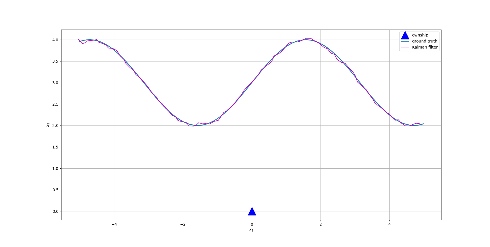

# Kalman filter 
Here is a implementation of Kalman filter in a 2-D target tracking scenario. Kalman filter follows recursive Bayesian estimation i.e. it is an instance of Bayes filter.

Problem description: A target is moving in a 2D plane. The ownship position is known and fixed at the origin. We have access to noisy measurements that directly observe the target 2D coordinates at any time step. Our goal is to estimate the 2D position of moving target.

