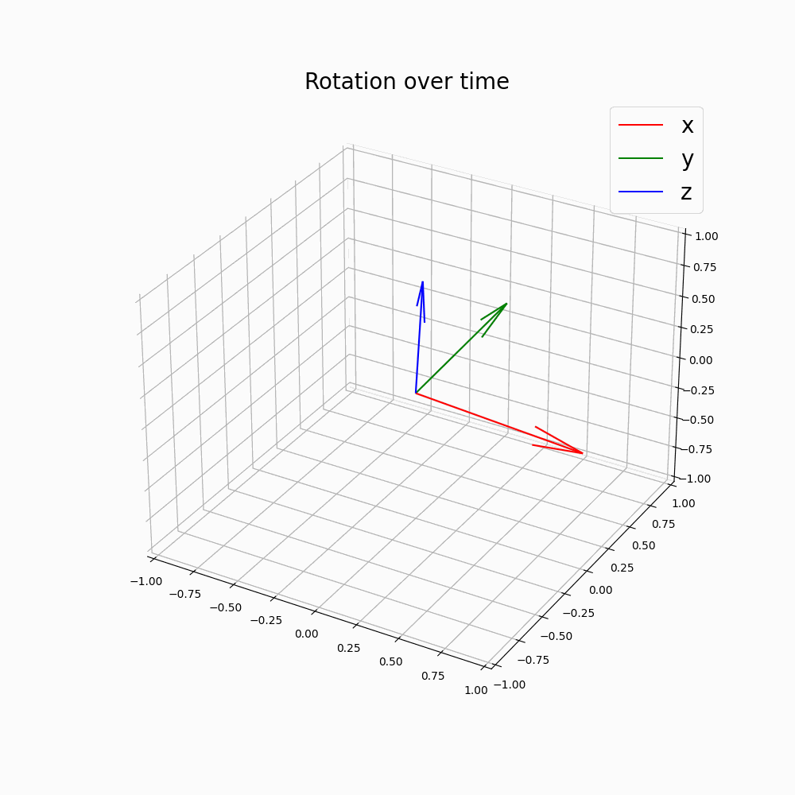

# Rigid body transformation using Lie groups
Here I have provided a brief overview of the use of Lie groups to describe rotations, SO(3), and rigid body transformations, SE(3). Please run 'Lie_groups.ipynb' to understand the maths behind the transformations using Lie groups and Lie algebra, and at the end you can also visualize the transformations. 

# Results

