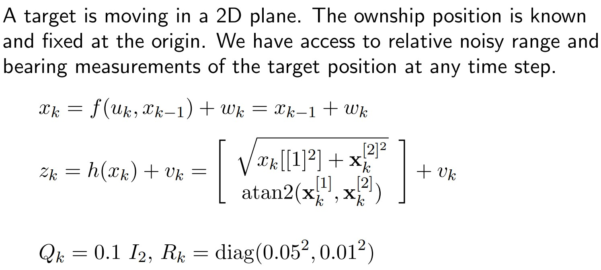

# Particle Filter
Here is an implementation of Particle filter in a 2-D target tracking scenario. Particle filter is different from a Kalman filter, in the sense that it uses particles for state estimation. Additionally, these particles can lead to optimal results even under non-Gaussian noise environments. In my implementation, I have used Sequential Importance Sampling (SIS) particle filter algorithm, with low variance resampling.

# Problem description

# Algorithm used

# Results
