## 🤖 Bayesian Filtering & SLAM                                                               
Note:  This project is a culmination of my work for the **"ROB 530: Mobile Robotics: Methods & Algorithms"** course, conducted from January to April 2023. It showcases various methods for state estimation, localization, mapping, and SLAM, essential for ground vehicles, underwater robots, and aerial vehicles.
<!-- 

      

 -->
<!-- 

    

        
    

    

        
    

 -->

  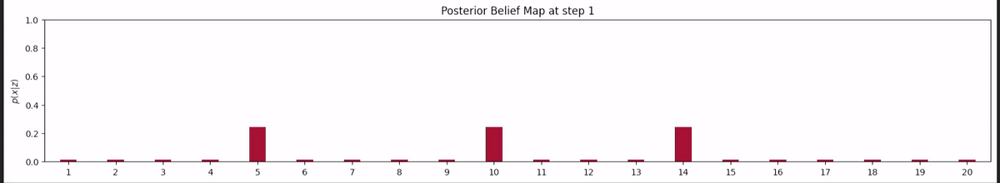
  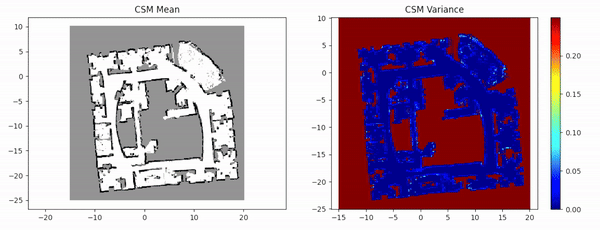
  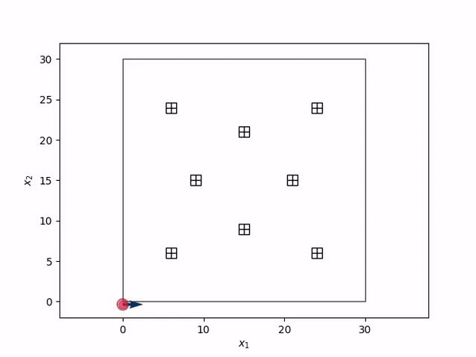
  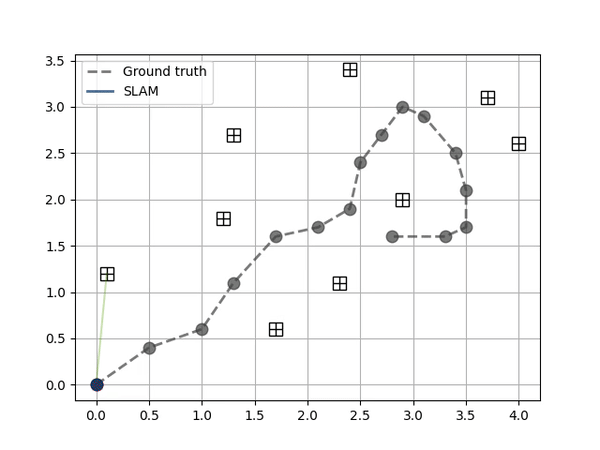

### 🎯 Goal
This repository encompasses several critical components of autonomous robotic systems, including:

- **State estimation**: Implementing target tracking for 1D, 2D, and 3D scenarios using various filters such as Kalman Filter (KF), Extended Kalman Filter (EKF), Unscented Kalman Filter (UKF), Particle Filter (PF), and Invariant Extended Kalman Filter (InEKF). Attitude-Heading Reference system using Right Invariant Extended Kalman Filter (R-InEKF). 
- **Mapping**: Implementing algorithms for discrete, continuous 2D occupancy grid both with and without semantic categories.
- **Localization**: Implementing algorihms for robot localization using various filters.
- **SLAM**: Implementing various types of SLAM: 2D EKF-based SLAM, Least Squares SLAM, Incremental Least Squares SLAM, 2D & 3D Pose Graph SLAM.

## ⚙️ Prerequisites
- Python libraries:
    - Numpy
    - Matplotlib
    - Scipy
    - ROS Noetic (for one of the cases of Robot localization)
    - gtsam (for Pose Graph SLAM)
    - sksparse (for Batch Least Squares SLAM)

## 🛠️ Test/Demo
- State Estimation
    - Target tracking
        - 1D Circular hallway robot tracking
            - Launch the jupyter notebook containing Bayes filter implementation
        - 2D Aircraft tracking
            - KF: Run the 'kf_single_target.py'
            - EKF: Run the 'ekf_single_target.py'
            - UKF: Run the 'ukf_single_target.py'
            - PF: Run the 'pf_single_target.py'
        - 3D Camera-based tracking
            - Launch the jupyter notebook containing EKF and PF implementations (batch & incremental)
    - Attitude-Heading Reference System
            - Without bias in accelerometer: Run 'without_bias_riekf.py'
            - With bias in accelerometer: Run 'with_bias_imperfect_riekf.py'
- Mapping
    - Run 'run.py' with argument (1-4) to choose discrete or continuous 2D occupancy grid mapping, and whether semantic or not
- Localization
    - inner_landmarks
        - Run 'riekf_localization_se2.py' or launch the notebook
    - outer_landmarks:
        - Run 'run.py' and other instructions for visualization and which filter to use mentioned in the README inside the directory
- SLAM
    - 2D EKF and Least-Sq. SLAM (Batch & Incremental)
        - EKF SLAM: Run 'ekf_slam.py'
        - Least Squares SLAM (batch): Run 'ls_slam.py'
        - Incremental Least Squares SLAM: Run 'ls_incremental_slam.py'
    - 2D & 3D Pose Graph SLAM
        - Run 'main.py' with appropriate arguments specifying Gauss-Newton SLAM or Incremental SLAM, and whether 2D or 3D SLAM

## 📊 Results
### 📈 State Estimation
#### Target tracking
- 1D Bayesian filtering for tracking robot position in a circular hallway

      

<!-- - 2D Aircraft tracking

  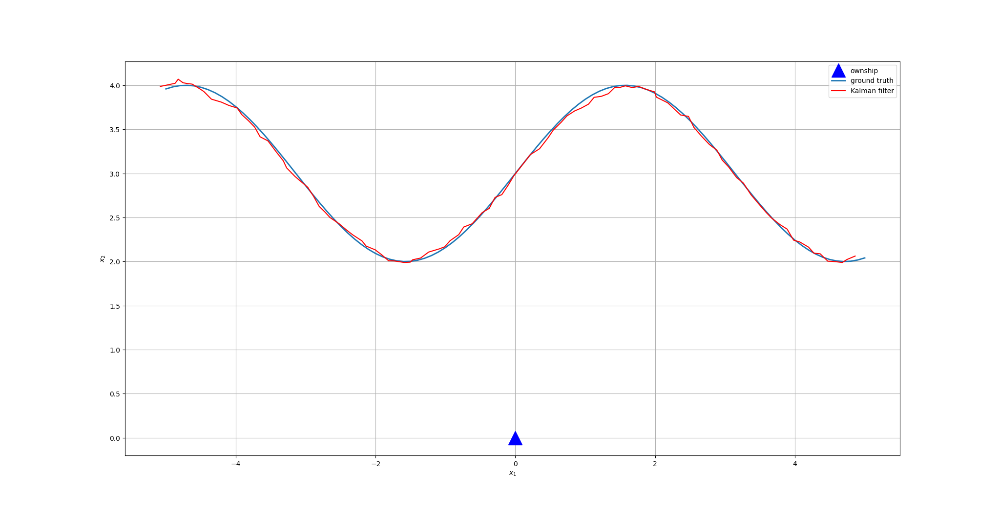
  
  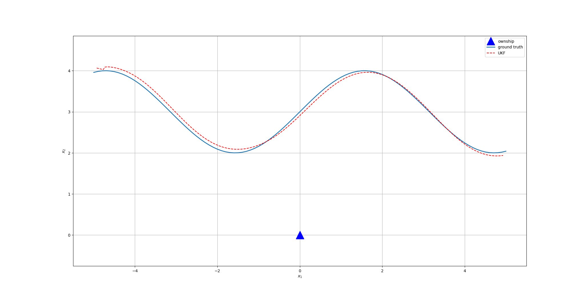
  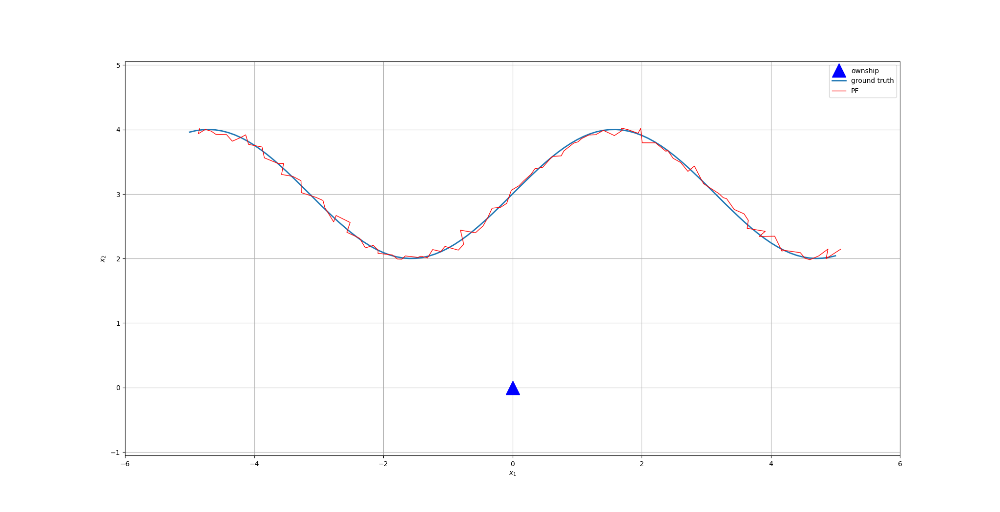

 -->
- 2D Aircraft tracking
<table align="center">
  <tr>
    <td align="center">
      <figcaption>Kalman Filter (KF)</figcaption>
      
    </td>
    <td align="center">
      <figcaption>Extended Kalman Filter (EKF)</figcaption>
      
    </td>
  </tr>
  <tr>
    <td align="center">
      <figcaption>Unscented Kalman Filter (UKF)</figcaption>
      
    </td>
    <td align="center">
      <figcaption>Particle Filter (PF)</figcaption>
      
    </td>
  </tr>
</table>

#### Camera-based tracking of an object in 3D space 

  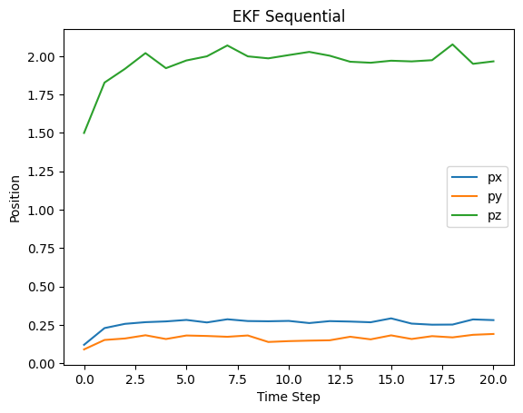
  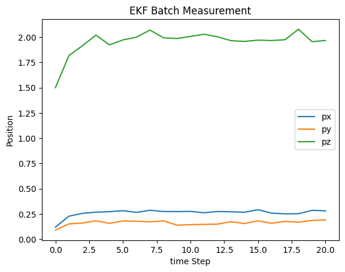
  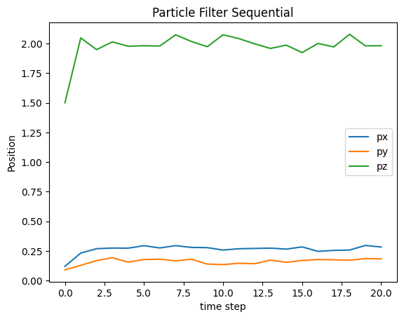
  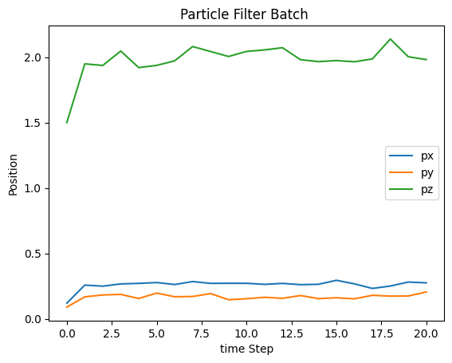

### 📈 Mapping

  
  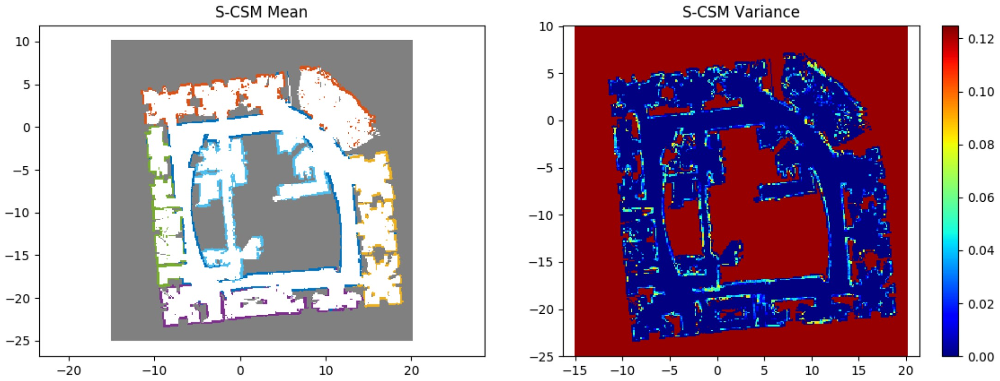
  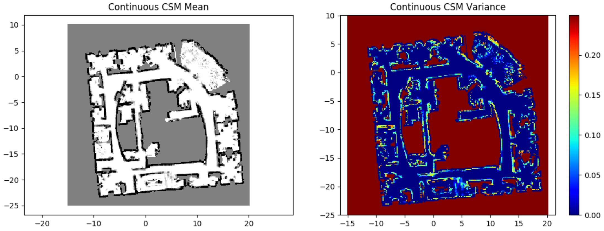
  

### 📈 Robot Localization
#### With landmarks inside the field

      

#### With landmarks outside the field

  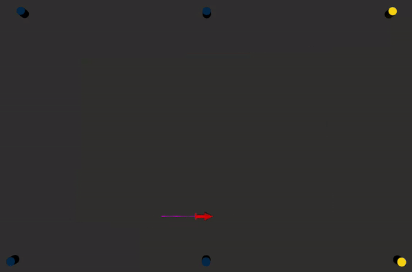
  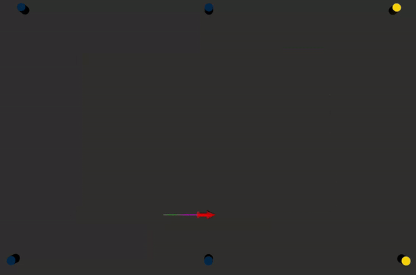
  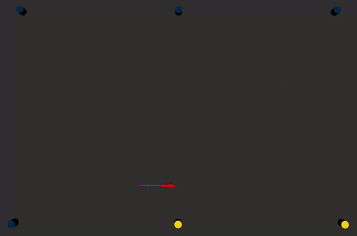
  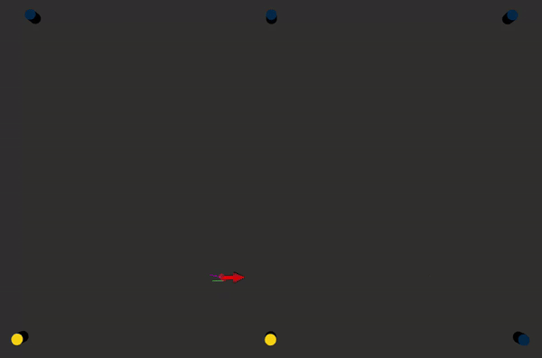

### 📈 Simultaneous Localization & Mapping (SLAM)
#### EKF-based SLAM, and Least Squares SLAM:
- EKF-based SLAM

      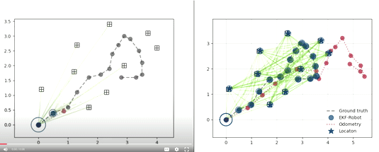

- Least Squares SLAM:

    - Batch
    

      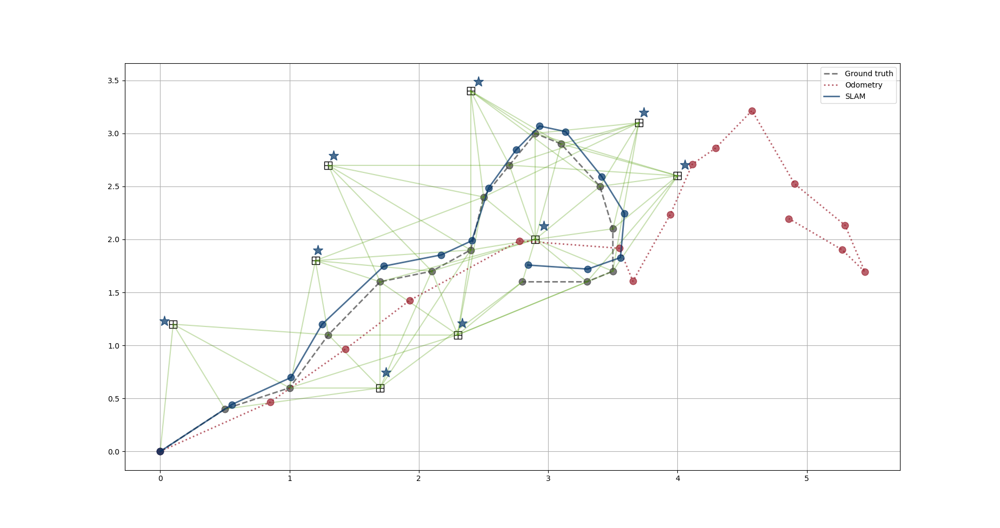
    

    - Incremental
    

      
    

#### 2D and 3D Pose Graph SLAM:
- 2D Batch Gauss-Newton Graph SLAM (Intel dataset)

      

- 2D Incremental Least Squares Graph SLAM (Intel dataset)

      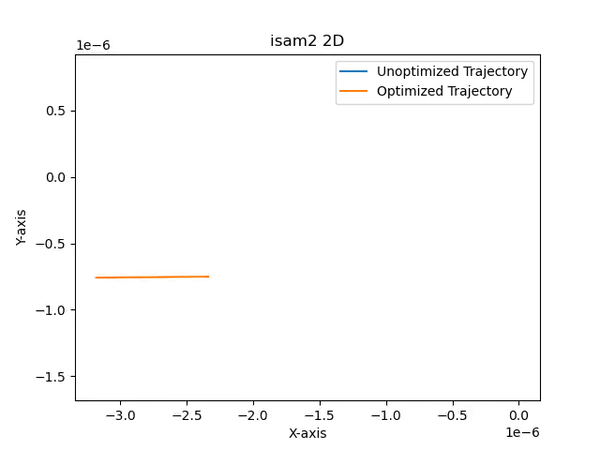

- 3D Batch Gauss-Newton Graph SLAM (Parking garage dataset)

      

- 3D Incremental Least Squares Graph SLAM (Parking garage dataset)

      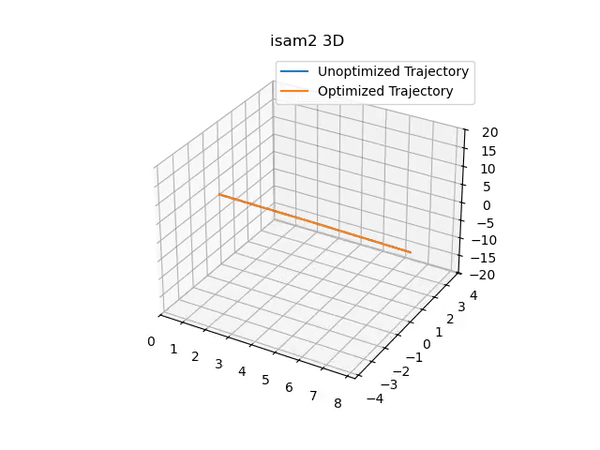

