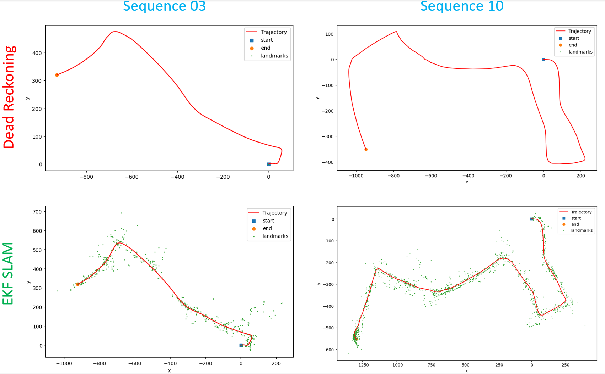

# Visual Inertial SLAM

Simultaneous localization and mapping (SLAM) is the computational problem of constructing or updating a map of an unknown environment while simultaneously keeping track of an agent's location within it. In this project, we implement a visual inertial SLAM system from scratch. The system is tested on sequences from the KITTI dataset, especially sequences 03 and 10.

<!-- Load the final results -->


# Run the Code

To run the code, use the following command:

```bash
python main.py --scene <scene_name> --device <cpu/cuda/mps>
```

This will run the EKF SLAM algorithm on the specified scene.

# Code Structure

The file `main.py` is simply a script that loads the data and runs through the timestamps to call the SLAM algorithm. The file `slam/ekf.py` contains the bulk of the SLAM logic, with definitions for the predict step, update step, and pose transformations. It stores the state of the system - robot pose and landmark positions - and updates it at each time step. The file `utils/vis.py` contains functions to visualize the robot trajectory and the map. The file `utils/pose.py` contains utility functions for manipulating the pose, such as converting between the lie algebra and lie group representations. The file `utils/data.py` contains functions to load the data from the KITTI dataset. The KITTI dataset sequences are placed in 'data' directory.