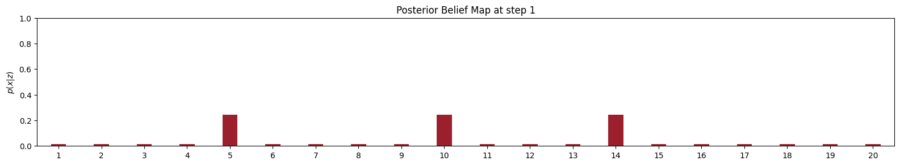
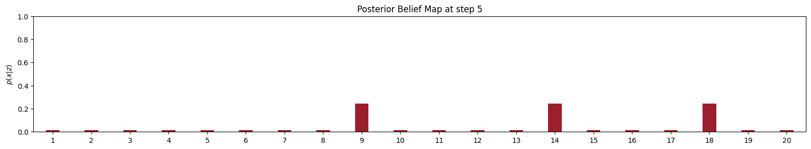

# Bayes filter 
Here is a implementation of Bayes filter in a 1D circular grid world, with visualizations of prior belief, likelihood map, control sequence, & the posterior beliefs after each step.

