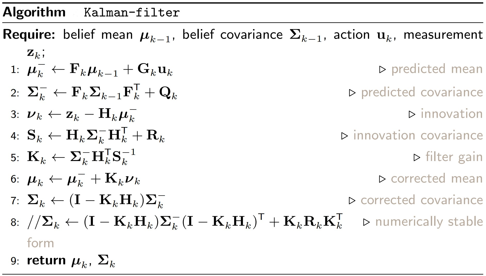

# Kalman filter 
Here is a implementation of Kalman filter in a 2-D target tracking scenario using range-bearing measurements. Kalman filter follows recursive Bayesian estimation i.e. it is an instance of Bayes filter. To test the implementation, please run 'kf_single_target.py'.

# Problem description

# Algorithm used

# Results

- RMSE for x: 0.12045962625789276
- RMSE for y: 0.07947022680561029