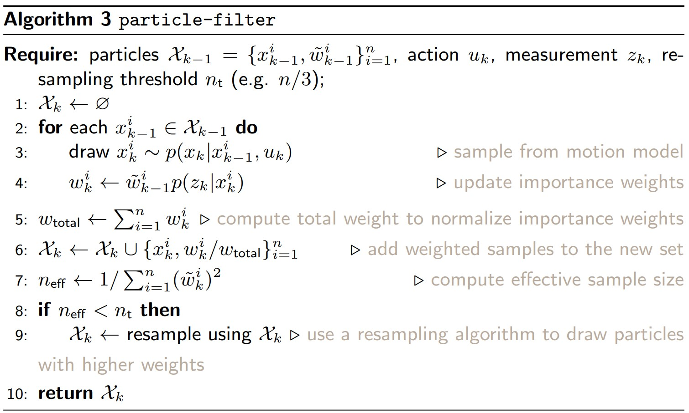

# Particle Filter
Here is an implementation of Particle filter in a 2-D target tracking scenario using range-bearing measurements. Particle filter is different from a Kalman filter, in the sense that it uses particles for state estimation. Additionally, these particles can lead to optimal results even under non-Gaussian noise environments. In my implementation, I have used Sequential Importance Sampling (SIS) particle filter algorithm, with low variance resampling. Plus, upon running 'pf_single_target.py', a live visualization of state estimation is also presented.

# Problem description

# Algorithm used

# Results

- RMSE for x: 0.0506806397884717
- RMSE for y: 0.05046825970440439