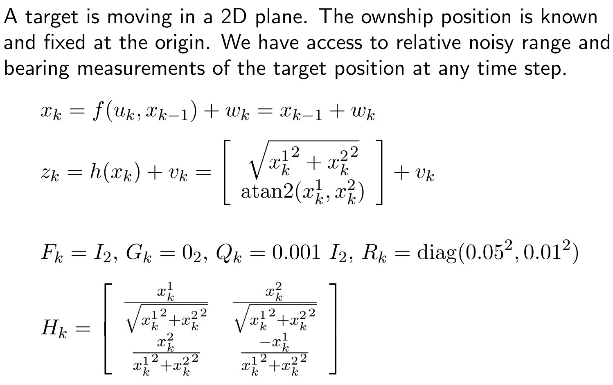
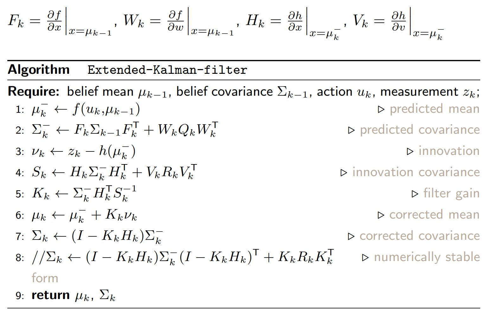
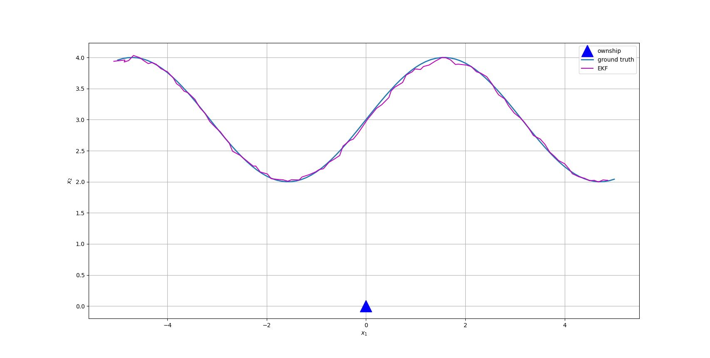

# Extended Kalman filter (EKF)
Here is an implementation of Extended Kalman filter in a 2-D target tracking scenario. EKF is an extension of Kalman filter with the advantage that this algorithm even works when the motion model and measurement model are non-linear. To test the implementation, please run 'ekf_single_target.py'.

# Problem description

# Algorithm used

# Results
