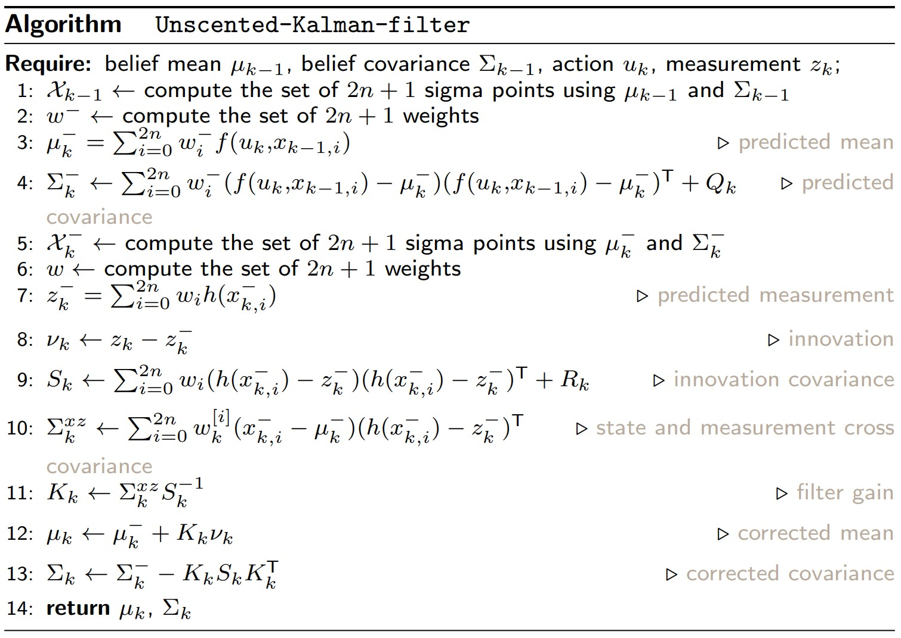

# Unscented Kalman filter (UKF)
Here is an implementation of Unscented Kalman filter in a 2-D target tracking scenario. UKF is an extension of Kalman filter, and just like EKF this algorithm also works when the motion model and measurement model are non-linear. This algorithm gives better state approximation than EKF, and on top of that there are no derivatives in UKF.

# Problem description

# Algorithm used

# Results
